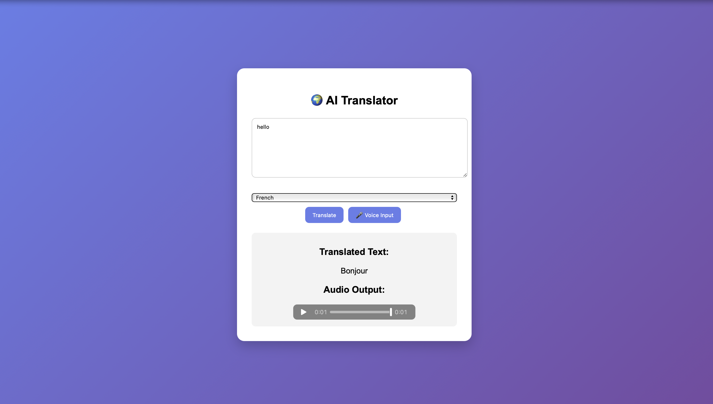

# AI Powered Multi Language Translator

This project is a web-based AI translator that converts speech to text, translates it into multiple languages, and generates audio output.

## Technologies Used
- Python
- Flask
- SpeechRecognition
- Google Translate API
- gTTS
- HTML
- CSS
- JavaScript

## Features
- Voice input
- Multi-language translation
- Audio output for translated text
- Simple web interface

## How to Run

1. Install required libraries

pip install flask googletrans==4.0.0-rc1 SpeechRecognition gTTS

2. Run the application

python app.py

3. Open browser

http://127.0.0.1:5000
## Project Interface

